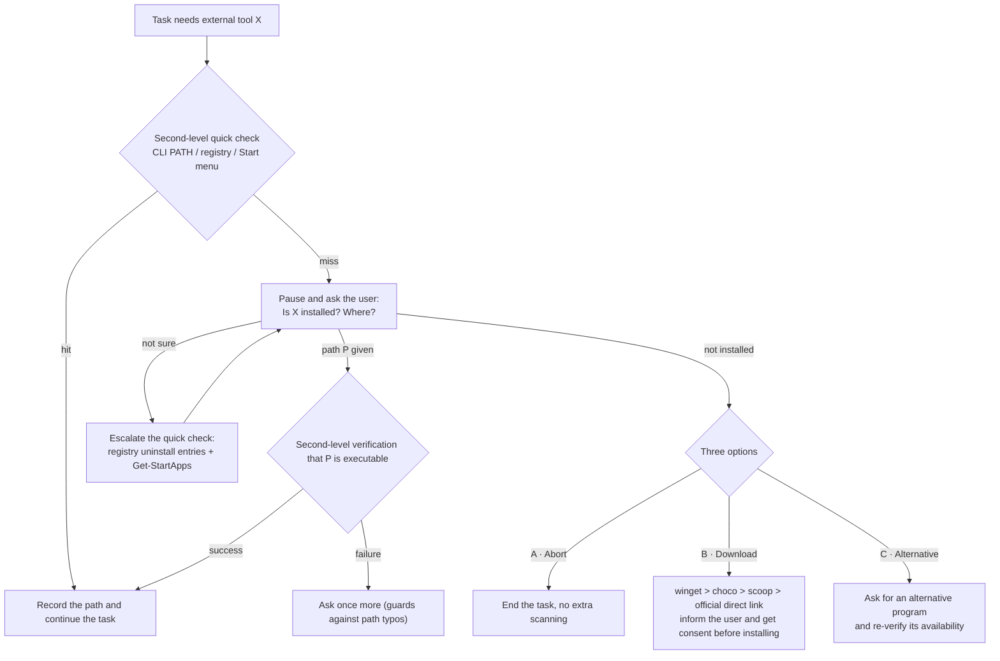

# tool-location-confirm — Ask-Before-Search Tool Locator Skill

> **Language:** [简体中文](README.md) · English

> An [Agent Skill](https://agentskills.spec.ac/) for AI agents: when a task needs an external program/tool, disk-wide scanning is forbidden — run a second-level quick check first, then confirm with the user "is it installed, and where?"; if it doesn't exist, offer three exits: **abort / download / alternative**.

[](LICENSE)

## What Problem It Solves

When AI assistants run tasks like "compress these images" or "transcode with FFmpeg", there are two time-wasting failure modes:

1. **Disk-wide search**: recursively searching the whole drive for `magick.exe` or `ffmpeg.exe` — minutes wasted, and possibly still not found;
2. **Acting without consent**: starting a download and install right after the quick check misses, bypassing the user's intent and potentially polluting the system environment.

This skill blocks both paths: **anything the disk can answer gets a second-level quick check; only humans know the rest (custom install locations, preferences, alternatives) — so ask the user**.

## Workflow



### Design Highlights

| Mechanism | Description |
|------|------|
| Layered second-level quick check | CLI programs via `where.exe` / `Get-Command`; GUI programs via registry Uninstall keys + `Get-StartApps` |
| Loop limits | "Ask again" at most 2 rounds, preventing Q&A dead loops |
| Batch asking | When several tools are missing at once, merge into a single question instead of interrupting one by one |
| Memory hooks | Confirmed paths go into a cross-session cache (e.g. `tool_locations.md`); still re-verified in seconds before reuse |
| Safety boundaries | Download priority winget > choco > scoop > official direct link; no silent installs, no unauthorized PATH changes |

## Installation

Drop `SKILL.md` into your agent's skills directory:

```
<mcp-servers>/skills/tool-location-confirm/SKILL.md
```

For multi-agent sharing, a **single source + Junction** wiring is recommended (Windows):

```powershell
New-Item -ItemType Junction -Path '<agent-skills-dir>\tool-location-confirm' `
                         -Target 'D:\ai-use\mcp-servers\skills\tool-location-confirm'
```

## Field-Tested

Real rehearsal log (simulated task: "compress images and convert to webp", requiring drawing tools):

| Step | Observed behavior | Result |
|------|---------|------|
| Second-level quick check (no scanning) | Three layers: CLI PATH + registry + Start menu, done in about 1 second | ✅ |
| Hit → use directly | ImageMagick hit directly, no question asked | ✅ |
| Miss → pause and ask | Inkscape missed; stopped immediately to ask the user, no disk scan started | ✅ |
| Three-option branching | After the user answered "not installed": A abort / B download / C alternative | ✅ |
| C branch execution | Switched to `magick` and re-verified executability | ✅ |
| Memory write | Two conclusions cached; the same task next time skips the question | ✅ |

An interesting finding: the `magick` that was hit was **not on the global system PATH** but in the app's bundled toolchain directory — a single-dimension check easily misses it, which is exactly why layering matters.

## Scope

- This skill covers **locating local programs and handling missing ones**; searching the web for ready-made solutions belongs to other skills (e.g. search-first).
- Typical trigger words: find a tool, locate a program, where is it installed, missing-dependency check.

## License

[MIT](LICENSE) © 2026 ghgjkbf
