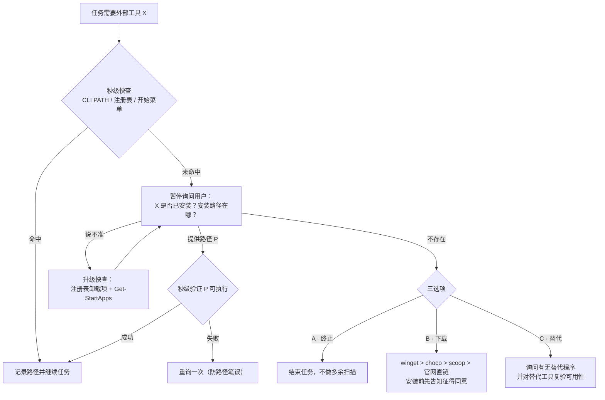

# tool-location-confirm — 先问后查的工具定位技能

> 一个面向 AI Agent 的 [Agent Skill](https://agentskills.spec.ac/)：当任务需要调用外部程序/工具时，禁止全盘扫盘检索——先秒级快查，再向用户确认"装没装、装在哪"；确认不存在时给出三个出口：**终止 / 下载 / 换替代**。

[](LICENSE)

## 解决什么问题

AI 助手在执行「帮我压缩图片」「用 FFmpeg 转个码」这类任务时，最浪费时间的失败模式有两种：

1. **全盘检索**：对整块硬盘递归搜索 `magick.exe`、`ffmpeg.exe`，动辄几分钟还可能找不到；
2. **擅作主张**：快查没找到就直接开始下载安装，绕过用户意愿甚至污染系统环境。

本技能把这两条路都堵死：**磁盘查得出来的走秒级快查；只有人知道的（自定义安装位置、偏好、替代方案）开口问用户**。

## 工作流程



### 设计要点

| 机制 | 说明 |
|------|------|
| 秒级快查分层 | CLI 程序用 `where.exe` / `Get-Command`；GUI 程序查注册表 Uninstall 键 + `Get-StartApps` |
| 循环限制 | 「重询」最多 2 轮，防止问答死循环 |
| 批量询问 | 多个工具同时缺失时合并为一次提问，不逐个打扰 |
| 记忆挂钩 | 已确认的路径写入跨会话缓存（如 `tool_locations.md`），复用前仍须秒级验证 |
| 安全边界 | 下载优先级 winget > choco > scoop > 官网直链；禁静默安装、禁擅改 PATH |

## 安装

把 `SKILL.md` 放入你的 Agent 技能目录即可：

```
<mcp-servers>/skills/tool-location-confirm/SKILL.md
```

多 Agent 共享时推荐**单源 + Junction** 方式接线（Windows）：

```powershell
New-Item -ItemType Junction -Path '<agent-skills-dir>\tool-location-confirm' `
                         -Target 'D:\ai-use\mcp-servers\skills\tool-location-confirm'
```

## 实测验证

以下为真实演练记录（模拟任务：「压缩图片并转 webp」，需要绘图工具）：

| 环节 | 实测表现 | 结果 |
|------|---------|------|
| 秒级快查（禁扫盘） | CLI PATH + 注册表 + 开始菜单三层检查，约 1 秒完成 | ✅ |
| 命中即用 | ImageMagick 直接命中，免询问 | ✅ |
| 未命中 → 暂停询问 | Inkscape 未命中后立即停下问用户，未开始扫盘 | ✅ |
| 三选项分流 | 用户答"未安装"后呈现 A 终止 / B 下载 / C 替代 | ✅ |
| C 分支执行 | 改用 `magick` 并复验可执行 | ✅ |
| 记忆写入 | 两条结论写入缓存，下次同任务跳过提问 | ✅ |

一个有趣的发现：命中的 `magick` **不在系统全局 PATH**，而在应用自带的工具链目录里——单一维度检查很容易漏掉，这正是分层的价值。

## 适用边界

- 本技能管**本机程序的定位与缺失处置**；联网搜现成方案属于其他技能（如 search-first）的职责。
- 典型触发词：查找工具、找程序、安装在哪、依赖缺失确认。

## License

[MIT](LICENSE) © 2026 ghgjkbf
